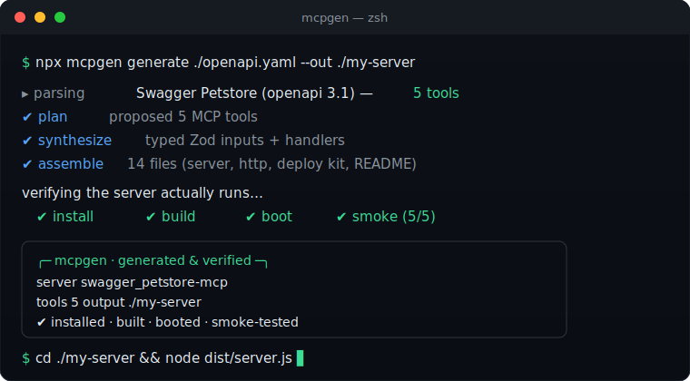

<div align="center">

# mcpgen

### Turn any API into an MCP server an AI agent can actually use.

Point it at an **OpenAPI spec**, a **GraphQL schema**, or a **code repo** — get a
working, typed, deployable [Model Context Protocol](https://modelcontextprotocol.io)
server back. Verified to run, not just generated.

[](https://github.com/MobsLInep/mcpgen/actions/workflows/ci.yml)
[](https://github.com/MobsLInep/mcpgen/actions/workflows/codeql.yml)
[](https://www.npmjs.com/package/mcpgenx)
[](https://mcpgen-cli.vercel.app)
[](https://nodejs.org)
[](./LICENSE)
[](https://github.com/MobsLInep/mcpgen/stargazers)

```bash
npx mcpgenx generate ./openapi.yaml --out ./my-server
```



</div>

---

## Why this exists

The Model Context Protocol lets AI agents call real tools — but the tooling
around it is thin. Today, wrapping an existing API as an MCP server means
hand-writing a pile of glue: a tool schema per endpoint, input validation, an
HTTP client, auth wiring, a transport, a Dockerfile — and then debugging why your
agent can't call any of it.

That work is mechanical, error-prone, and **already described by your API's own
spec**. mcpgen reads the spec and does it for you — the way it should be done:
every input Zod-validated, every upstream URL built safely, credentials from the
environment, and a security posture that follows the OWASP secure-MCP checklist
out of the box.

And it doesn't just emit code and hope. mcpgen **installs, builds, boots, and
smoke-tests** every server it generates — repairing failures with the model —
so what you get is proven to run.

## Quickstart

Requires **Node 20+**. An `ANTHROPIC_API_KEY` is optional (without one, mcpgen
generates in a deterministic offline mode).

```bash
npx mcpgenx doctor                                          # 1. check your env
npx mcpgenx generate ./openapi.yaml --out ./my-server      # 2. generate + verify
cd my-server && npm install && npm run build && node dist/server.js   # 3. run
```

Prefer to be walked through it? `npx mcpgenx init` is a guided wizard.

→ **Full docs: [mcpgen-cli.vercel.app](https://mcpgen-cli.vercel.app)** —
[quickstart](https://mcpgen-cli.vercel.app/quickstart) ·
[concepts](https://mcpgen-cli.vercel.app/concepts) ·
[guides](https://mcpgen-cli.vercel.app/guides/openapi) ·
[connect a client](https://mcpgen-cli.vercel.app/connect)

## Features

- **Three inputs, one engine** — OpenAPI 3.0/3.1, GraphQL SDL/introspection,
  and Express/Fastify code all normalize to a shared IR.
- **Typed & validated** — Zod-validated inputs, one safe `http.ts` request
  builder, env-sourced credentials. No raw string interpolation into URLs.
- **Self-verifying** — install → build → boot → smoke-test against a mocked
  upstream, with model-driven self-repair on failure.
- **Deploy-ready** — every server ships a Dockerfile, Compose, and Fly /
  Render / Railway configs, plus a `/healthz` probe.
- **Connects everywhere** — copy-paste config for Claude Desktop, Cursor, and
  VS Code is generated into each server's README.
- **Secure by default** — generated code passes an automated OWASP secure-MCP
  audit; mcpgen's own source is linted by the same rules.
- **Works offline** — no API key? Generation falls back to a deterministic,
  IR-only path so you always get a buildable server.
- **CLI + Web** — a polished `mcpgen` CLI and a paste-and-download web UI.

## How it works

```text
 source ──▶ parse ──▶  IR  ──▶ plan ──▶ synthesize ──▶ assemble ──▶ verify ──▶ server
(openapi/  (no LLM)   (tools +        (Claude)    (Zod + handlers)  (templates) (install·build·
 graphql/              metadata)                                                  boot·smoke + repair)
 repo)
```

Parsing is deterministic and LLM-free; the model proposes the tool set and writes
handler bodies (with a deterministic fallback); assembly renders real templates;
and verification proves the result runs. See
**[Concepts](https://mcpgen-cli.vercel.app/concepts)** and
**[Architecture](https://mcpgen-cli.vercel.app/architecture)**.

## Why not hand-write it?

|                            | Hand-writing an MCP server  | **mcpgen**                            |
| -------------------------- | --------------------------- | ------------------------------------- |
| Time to first server       | hours per API               | one command                           |
| Tool schema per endpoint   | write & maintain by hand    | generated from the spec               |
| Input validation           | you write the Zod           | Zod for every input, always           |
| Auth & URL building        | easy to get subtly wrong    | one safe, audited path                |
| "Does it actually run?"    | find out in your agent      | install·build·boot·smoke-tested first |
| Deploy config              | DIY Dockerfile/Compose/Fly… | shipped in the box                    |
| Security baseline          | up to you                   | OWASP secure-MCP audit by default     |
| Stays in sync with the API | manual                      | re-run on the new spec                |

## Monorepo layout

| Path                                         | Description                                                                                      |
| -------------------------------------------- | ------------------------------------------------------------------------------------------------ |
| [`packages/core`](./packages/core)           | Generation engine — a pure, reusable library (parse · plan · synth · assemble · verify · audit). |
| [`packages/cli`](./packages/cli)             | The `mcpgen` command (commander). Thin — parses args, calls core.                                |
| [`packages/templates`](./packages/templates) | MCP server code templates the engine renders.                                                    |
| [`apps/web`](./apps/web)                     | Next.js 15 web UI — paste an API, download a server.                                             |
| [`apps/api`](./apps/api)                     | Thin `node:http` backend the web UI calls.                                                       |
| [`apps/docs`](./apps/docs)                   | Documentation site (Nextra 4).                                                                   |

## Local development

```bash
pnpm install && pnpm build && pnpm lint && pnpm typecheck && pnpm test
```

Two extra gates also run in CI:

```bash
pnpm test:coverage   # enforces engine + verify coverage thresholds
pnpm security:lint   # OWASP secure-MCP audit (needs a prior build)
```

See [`CONTRIBUTING.md`](./CONTRIBUTING.md) and, for the full architecture record,
[`CLAUDE.md`](./CLAUDE.md).

## Roadmap

mcpgen v0.1.0 generates production-ready TypeScript MCP servers today. Next up:

- **Stateless Streamable HTTP** for the [2025-06-18 / 2026-07-28 MCP spec](https://modelcontextprotocol.io) — horizontally scalable, no per-session server state.
- **Python / FastMCP output** — generate a [FastMCP](https://github.com/jlowin/fastmcp) server alongside the TypeScript one.
- Richer GraphQL selection-set control and gRPC/AsyncAPI inputs.
- A hosted "paste a spec, get a server" playground.

Have a request? [Open an issue](https://github.com/MobsLInep/mcpgen/issues) —
look for [`good first issue`](https://github.com/MobsLInep/mcpgen/labels/good%20first%20issue)
if you'd like to contribute.

## Contributing

PRs welcome! Read [`CONTRIBUTING.md`](./CONTRIBUTING.md) and our
[Code of Conduct](./CODE_OF_CONDUCT.md). Then look for a
[good first issue](https://github.com/MobsLInep/mcpgen/labels/good%20first%20issue).

## Security

Found a vulnerability? See [`SECURITY.md`](./SECURITY.md) for responsible
disclosure. The [threat model](./THREAT_MODEL.md) maps each control to code.

## License

[MIT](./LICENSE) © mcpgen contributors.
